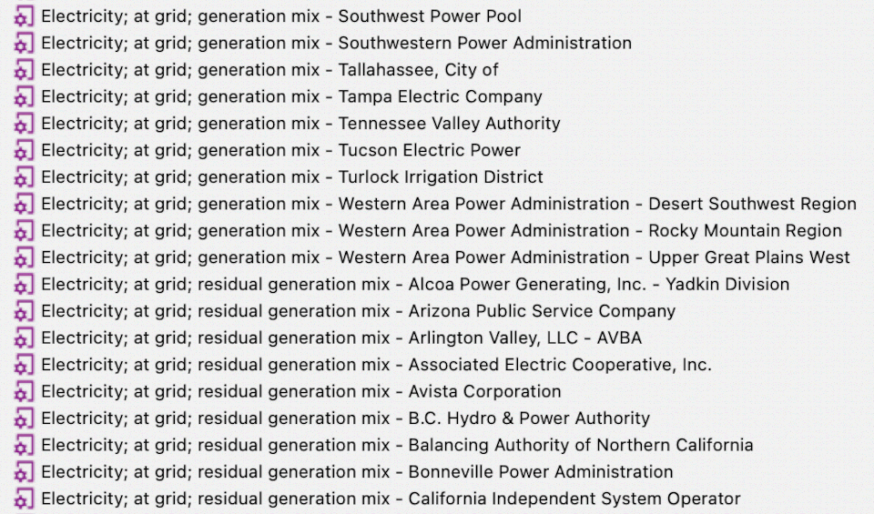

[](https://doi.org/10.18141/2575065)

# olca-tools
A series of Python modules and notebooks with tools and demonstrations for interacting with openLCA (version 2).


## Demos

### Automating the 'What if' scenarios
Running openLCA several times over for various scenario analysis can be tedious.
To assist with this process, the automate-what-if.ipynb demonstrates looping through several renewable energy scenarios (e.g., 100% wind, 100% solar, 100% nuclear) by changing the electricity generation mixes within the electricity baseline.
The results presented in the notebook are not intended for any practical application.


### Data Munging for a Coal Basin to Balancing Authority Crosswalk
The data_munging.ipynb notebook provides a demonstration of downloading data from the internet, cleaning the data, analyzing the data, and combining the data to create a crosswalk between U.S. coal basins and electricity balancing authorities.

***

## Use Cases
This package includes the Jupyter Notebook UP template (up_template.ipynb) and additional tools (found under the tools directory).
See descriptions of each below.


### ElectricityLCI Comparative Analysis
The Python package, ElectricityLCI, produces JSON-LD ZIP files for various runs of the electricity baseline.
The subtle differences between model runs can be analyzed using the elci_analysis.py module in this repository.

Add the JSON-LD files to the data folder, create a dictionary that points to each file, then send the dictionary to a series of functions to analyze their differences.
See the 'Examples' section in the modules documentation.


### Energy Outlook
The Python package, scenario-modeler, has a utility for generating electricity forecast mixes based on the EIA's Annual Energy Outlook.
The outputs are CSV files with primary fuel mixes for each balancing authority area.

The energy_outlook.py module provides methods to either connect to an openLCA database (using the IPC server) or open an exported JSON-LD file, find the electricity generation mix processes, and create new processes based on the given annual energy outlook mixes.
These methods are provided as a command-line interface (CLI) tool.

After installing netlolca, run the following command to add outlook mixes from CSV_NAME_HERE.csv to the JSON_FILE_NAME_HERE.zip.

```bash
python residual_grid_mix.py -c 2 -d data -f CSV_NAME_HERE.csv -p JSON_FILE_NAME_HERE.zip
```

The CLI options are given below.

    -c {1,2}, --connection {1,2}
        1: IPC-Server 2: JSON-LD
    -d directory, --directory
        folder path containing AEO mix CSV files
    -f file_name, --file_name
        AEO mix file name
    -p P_FILE, --p_file P_FILE
        JSON-LD file (optional)

### Finding Primary Fuel Categories
The ElectricityLCI can categorize and filter facility-level generation data to its primary fuel.
This use case examines how primary fuel categories change over time.

### Hawkins-Young Uncertainty Modeling
In openLCA, emission factors may be accompanied with an uncertainty distribution.
Where uncertainty is difficulty to measure, the Hawkins-Young method provides a modeling procedure to create a log-normal distribution centered around an emission factor, suitable for Monte-Carlo simulation.

The methods are currently published in the Python package, ElectricityLCI.
The development of these methods are presented in hawkins_young.py.


### Residual Electricity Generation Grid Mixes
The Python package, elci-to-rem, converts static generation mixes found in the electricity baseline to a residual mix by removing the generation amounts that were used in renewable electricity certificate sales.
The outputs are CSV files with primary fuel mixes for each balancing authority area.

The residual_grid_mix.py module in this repository provides the methods to either connect to an openLCA database (using the IPC server) or an exported JSON-LD zip file, find the electricity generation mix processes, and create new processes based on the residual mixes found in the CSV files (produced by elci_to_rem, as noted above).
These methods are provided as a command-line interface tool.

The CSV files from elci_to_rem are assumed located in the 'data' directory (or may be defined using the `-r` flag).

After installing netlolca, run the following command to edit an openLCA database.

```bash
$ python residual_grid_mix.py -c 1 -r data -m 1
```

The CLI options are given below.

    -c {1,2}, --connection {1,2}
        1: IPC-Server
        2: JSON-LD
    -r RES_DATA, --res_data RES_DATA
        folder path containing residual mix CSV files
    -m {1,2,3,4}, --mix {1,2,3,4}
        residual mix file (one of four options)
    -y YEAR, --year YEAR
        year associated with electricity generation, defaults to 2020
    -p P_FILE, --p_file P_FILE
        JSON-LD file (optional if using -c 2)

The results of this method create new residual mix generation processes in an openLCA project (e.g., see example in the figure below).


